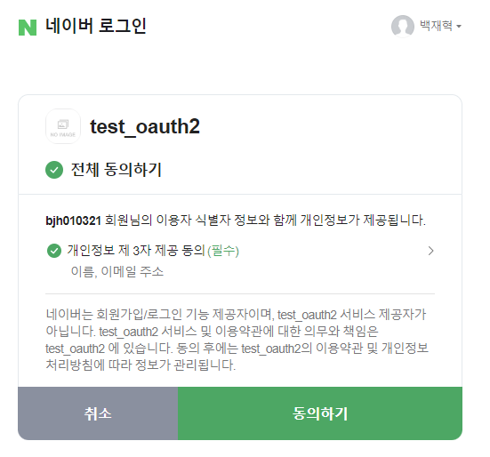
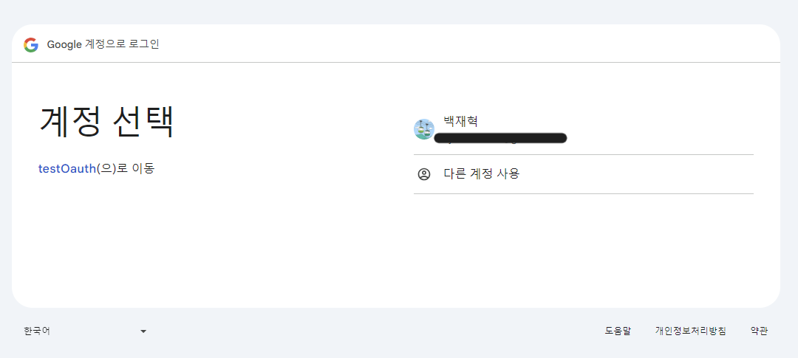
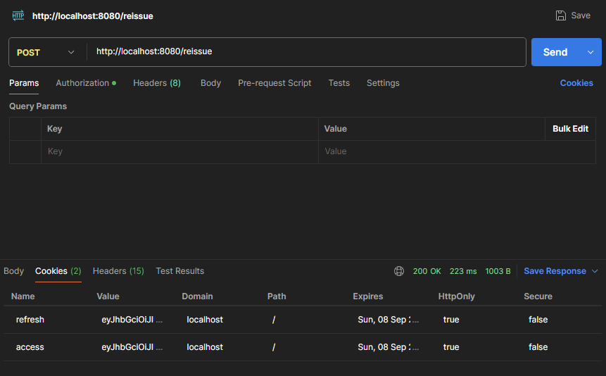

# 구글 및 네이버 소셜 로그인 구현

## 1. 프로젝트 설명

구글 및 네이버 소셜 로그인 API를 활용하여 로그인 기능을 제공하는 웹 애플리케이션입니다. 로그인한 사용자의 정보를 MySQL 데이터베이스에 저장하고, 
인증과 인가를 위해 Access Token과 Refresh Token을 발급합니다. 또한, Redis를 활용하여 Refresh Token을 안전하게 관리하고, 
Access Token이 만료된 경우, Refresh Token를 비교하는 과정을 통해 재발급 처리하는 로직을 구현하였습니다.

---

## 2. 주요 기능

* **구글 / 네이버 소셜 로그인**: `OAuth 2.0 Client`를 통해 사용자는 구글 또는 네이버 계정을 통해 로그인할 수 있습니다.

* **Access Token/Refresh Token 발급**: 로그인 성공 시 Access Token과 Refresh Token을 발급하여 인증 및 인가 처리를 진행합니다.

* **회원 정보 관리**: 로그인한 사용자 정보를 `MySQL DB`에 저장하여 관리합니다.

* **Refresh Token 관리**: Refresh Token의 탈취를 방지하기 위해 Refresh Token은 `Redis`에 저장하여 관리합니다.

* **토큰 재발급 로직**: Access Token이 만료된 경우, `Redis`에 저장된 Refresh Token을 검증하여 새로운 Access Token과 Refresh Token을 재발급합니다.

---

## 3. 실행 화면

### 1) NAVER Login

    

### 2) GOOGLE Login

    

### 3) Access 토큰 재발급 

    

---

## 4. 구현 시 고려사항

### 1. OAuth 프론트/백엔드 책임 방식 

카카오 데브톡에 따르면 웹 서비스의 인가 코드 처리는 백엔드에서 도맡아 처리하도록 권장하고 있고, 앱 서비스의 경우, SDK를 활용하여 모든 흐름을 프론트 측에서 처리하고, 백엔드로 전달하는 방법을 권장하고 있습니다.

### 2. 쿠키 or 헤더 ?

다중 토큰을 활용한 로그인 기능을 구현하면서 Access Token은 Header에, Refresh Token은 쿠키에 담았었다. 하지만 OAuth Client JWT 방식에서는 
소셜 로그인을 성공하면 프론츠 측에서 `<a herf>` 와 같은 하이퍼 링크 형태로 요청을 보내기에 헤더에 담긴 값을 파싱할 수 없어 쿠키로 발급했다.

### 3. Cross-origin resource sharing, CORS

추후 외부 도메인에서 해당 애플리케이션에 접근할 수 있도록 `Spring Security`을 통해
CORS 관련 설정을 해 두었다. 주의할 점은 CORS는 Spring Security보다 먼저 처리되어야 한다.

